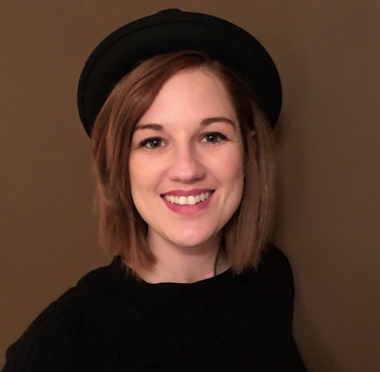
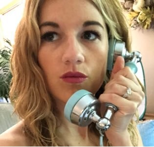

# bio

 
Cassie is a Cloud Developer Advocate at Microsoft and .Net Software Engineer. She got into development when she started automating her job with excel macros and realized coding is life. Now she enjoys working in technologies with two letter abbreviations: AI/ML, MR/VR/XR/AR. But really, she loves all things tech and enjoys building with many technologies. Outside of programming she loves yoga, music, ukulele, biking, puppies, and whatever flavor of the year hobby has caught her attention.
